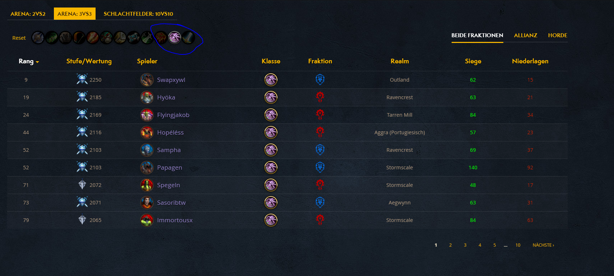

# wow ladder filter

fügt eine filter funktion zur wow rangliste hinzu, nach klassen.

funktioniert leider bis jetzt nur für den deutschen client

für chrome benötigt ihr hierfür die erweiterung tampermonkey: [download](https://chrome.google.com/webstore/detail/tampermonkey/dhdgffkkebhmkfjojejmpbldmpobfkfo?hl=de)

für mozilla die erweiterung greasemonkey: [download](https://addons.mozilla.org/de/firefox/addon/greasemonkey/)

## filter script laden

durch klicken auf: [script](https://raw.githubusercontent.com/Sly321/ladder-filtering/master/wow-ladder-filter.user.js) könnt ihr euch das script installieren.

## beispiel

